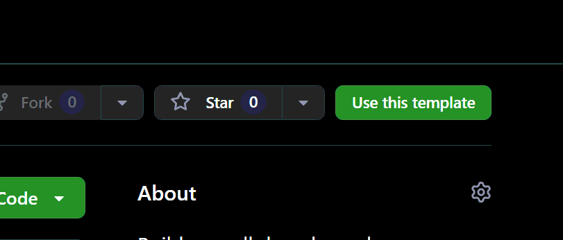
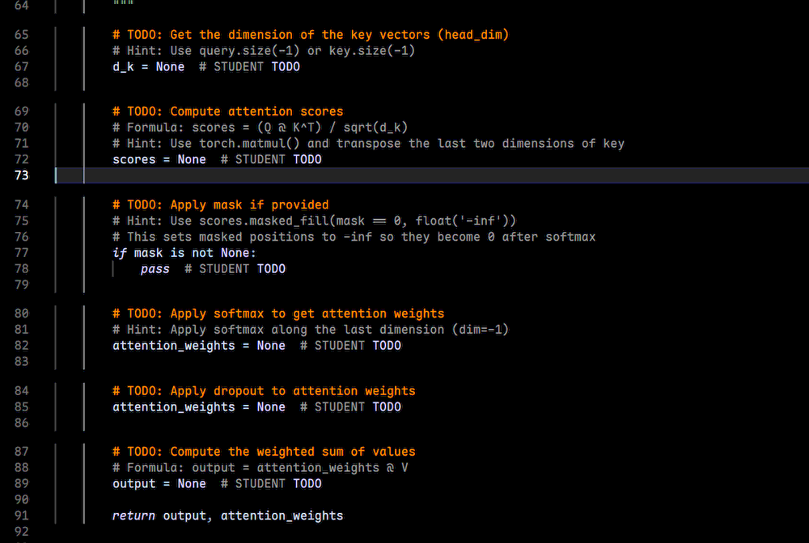

# CSC591 Lab 3: Building a Transformer Language Model from Scratch

Build a small decoder-only transformer in PyTorch, train it on text, and study
architecture and training trade-offs with controlled experiments.

## Course information

- Course: **CSC591/791 Software-Hardware Co-design for Intelligent Systems**
- Instructor: **Dr. Wujie Wen** (`wwen2@ncsu.edu`)
- Lab 3 Helper: **Gavin Gong** (`zgong6@ncsu.edu`)

## A few important notes

1. **AI use is allowed.** This lab does not forbid AI use. Whether you use AI is
   not the important part; the important part is whether you actually
   understand the system you build and learn from the process. If AI helps you
   learn faster and iterate better, that can be a good thing. You are still
   responsible for understanding, explaining, and defending your own work.
2. **Start early.** This lab includes implementation, debugging, training,
   experiments, and writing. It is much easier if you get the first baseline
   run working early.
3. **Do not panic if generation quality is modest.** Different students have
   different compute budgets. A weaker sample from a short run does not mean
   your pipeline is wrong.
4. **How to do better than the baseline.** It is not hard to earn the basic
   baseline credit if your end-to-end path works. The bigger scoring space is
   in clean controlled experiments, fair metric use, quality + cost evidence,
   reproducibility, and thoughtful analysis that shows real exploration rather
   than only following one canned path.
5. **The default training workload is not very high.** On our reference GPU,
   smaller English configs are on the order of about 1 minute and medium ones
   around 2 minutes, so the default path is intentionally lightweight. You are
   welcome to try larger configs or more advanced implementations if you want.

## Start here

Create your own **private repository** from the course template:



Click on "Use this template", create your private repository, 

**Your repository name should be: `lab3-<your-unity-id>`**.

and then clone it:

```bash
git clone <your-private-repo-url>
cd <your-repo-name>
pip install -e ".[dev]"
```

Some helper scripts download public datasets the first time you run them.
Those steps require:
- internet access
- the Python packages installed from `pyproject.toml`

Optional tooling note:
- the docs sometimes show `rg` (`ripgrep`) to search for `TODO`s
- if `rg` is not installed, `grep -RIn "TODO" ...` is a fine fallback
- `wandb` is optional and is not assumed to be preinstalled; only use it if you explicitly choose to install/configure it

Read these files first:
- [Lab Guide](docs/LAB_GUIDE.md)
- [Implementation Checklist](docs/IMPLEMENTATION_CHECKLIST.md)
- [Platform and Runtime Notes](docs/PLATFORM_AND_RUNTIME_NOTES.md)
- [Concept Notes](docs/LAB_CONCEPTS.md)
- [Questions](docs/LAB_QUESTIONS.md)
- [Evaluation Rubric](docs/EVALUATION_RUBRIC.md)
- [What to Submit](docs/WHAT_TO_SUBMIT.md)

## Repository structure

```text
.
├── README.md                        # starting point
├── docs/
│   ├── LAB_GUIDE.md                 # what to implement and how to proceed
│   ├── IMPLEMENTATION_CHECKLIST.md  # exact baseline code targets + validation map
│   ├── PLATFORM_AND_RUNTIME_NOTES.md # local / Colab startup and runtime notes
│   ├── LAB_CONCEPTS.md              # theory and math background
│   ├── LAB_QUESTIONS.md             # short-answer questions
│   ├── EVALUATION_RUBRIC.md         # grading criteria
│   └── WHAT_TO_SUBMIT.md            # final deliverables
├── src/
│   ├── components/                  # attention, positional encoding, norm, FFN
│   ├── model/                       # language model assembly
│   ├── data/                        # dataset and dataloader logic
│   ├── training/                    # loss, scheduler, trainer
│   ├── generation/                  # decoding methods
│   └── tokenizer/                   # tokenizer utilities
├── scripts/                         # dataset prep, training, generation, bonus tools
├── configs/                         # baseline configs you will run
├── assets/tokenizers/               # provided tokenizer assets
├── submission/                      # standalone inference template for Moodle
├── tests/                           # released tests
├── report/                          # your report and short answers
├── output/                          # local generated datasets / packed data / logs
└── checkpoints/                     # local trained checkpoints
```

## What is required

You are expected to complete:
- one working baseline transformer path
- one working tokenizer/data/training/generation path
- **two** controlled experiments
- a report in `report/main.md`
- short answers in `report/answers.md`

Optional or bonus extensions include things like RoPE, RMSNorm, GQA,
SwiGLU, and quantization. These should not block your baseline.

A good order is:
1. make one baseline path work end to end
2. pass the released baseline-path tests
3. run two clean experiments
4. write the report and short answers

Important scope reminder:
- you only need **one** baseline path at first
- do **not** try to implement every optional feature before your first end-to-end run works

## Metric quick reference

Use metrics that match the claim you want to make.

- **Validation loss:** the default quality metric for most baseline and ablation comparisons
- **Perplexity:** `exp(loss)`; compare it directly only when tokenization is the same
- **Token accuracy:** fraction of non-padding target tokens predicted exactly; useful as a helper metric, but not required as the main metric
- **Generation samples:** good supporting evidence, but not enough by themselves
- **Runtime, throughput, memory:** only when comparing efficiency or hardware trade-offs; be careful to control for confounding factors such as tokenization and training budget
- **Any other metric you design that actually supports your claim:** if you have a good idea for a new metric that better captures the trade-off you want to study, go for it! Just make sure to explain it clearly and why it is appropriate for your claim.

Practical interpretation:
- if tokenization changes, raw token-level perplexity is not a fair direct comparison
- if hardware differs, be careful with runtime and throughput claims
- if training budget differs, say so explicitly before interpreting quality differences

For short local-vs-Colab setup notes, reference single-GPU runtimes, and one
full-dataset generation example, see
[Platform and Runtime Notes](docs/PLATFORM_AND_RUNTIME_NOTES.md).

## How to find the code you need to implement

The starter repository includes many `TODO` markers. Use them to find the code
that still needs work. You can simply search for `TODO` across the whole codebase to find all of them:



if you are woring without graphical editor such as vscode, you can use `rg` or `grep` in the terminal:

```bash
rg -n "TODO" src scripts tests
```

A narrower search for the core lab path is:

```bash
rg -n "TODO" src/components src/model src/data src/training src/generation scripts
```

Important: **not every TODO is part of the required path**. Use
`docs/LAB_GUIDE.md` plus `docs/IMPLEMENTATION_CHECKLIST.md` to decide which
TODOs are required, optional, or bonus.

Practical interpretation:
- if a file or section is labeled **OPTIONAL EXTENSION**, its TODOs are not
  required for the baseline
- the Part 1 scope table in `docs/LAB_GUIDE.md` is the safest source of truth
  for the baseline model path
- the baseline training infrastructure in `src/training/scheduler.py` and
  `src/training/trainer.py` is now mostly prefilled so students do not get
  stuck on boilerplate before they can test the model path

## How to tell whether you are done with a stage

Use both of these:
- the relevant `pytest` marker for that stage
- one real command-line baseline run

Suggested validation flow:

```bash
pytest -m part1 -v
pytest -m part3_training -v
pytest -m part4_generation -v
pytest -m "not stretch" -v
```

Interpret these markers carefully:
- `part1` focuses on attention, masking, and the baseline LM wiring
- `part2_tokenizer` focuses only on training-your-own-tokenizer behavior; it is
  **not** required for the default English baseline because the repository
  already provides a tokenizer
- `part3_training` and `part4_generation` are **released smoke tests**, not a
  complete proof that every later-stage module is correct

Important:
- `pytest -v` also runs `stretch`
- `stretch` is for optional advanced features such as GQA / RoPE / RMSNorm
- so for a baseline completion check, prefer `pytest -m "not stretch" -v`

So stage completion still requires a real command-line run, not only `pytest`.

For an exact file/function-level execution map of the baseline path, see:
- [Implementation Checklist](docs/IMPLEMENTATION_CHECKLIST.md)

You are not done with the baseline until you can also do all of the following:
- train without crashing
- keep loss finite
- save and reload a checkpoint
- generate text from your trained checkpoint

## Recommended baseline

Use this path if you want the main default path for the lab.

```bash
python scripts/download_english_dataset.py \
  --dataset tinystories \
  --max_examples 50000 \
  --output_path output/english_data/tinystories_train_50k.jsonl

python scripts/prepare_packed_dataset.py \
  --input_path output/english_data/tinystories_train_50k.jsonl \
  --tokenizer_path assets/tokenizers/english_bytebpe_8k.json \
  --output_dir output/packed/tinystories_tiny \
  --max_seq_len 512 \
  --max_examples 50000 \
  --no_add_special_tokens

python scripts/train_model.py --config configs/tiny.yaml
```

Expected artifacts:
- raw dataset: `output/english_data/tinystories_train_50k.jsonl`
- packed dataset dir: `output/packed/tinystories_tiny/`
- checkpoint dir: `checkpoints/tiny/`

If you want to use `configs/small.yaml` or `configs/small_plus.yaml`, prepare a
packed dataset in the directory named by that config:

```bash
python scripts/prepare_packed_dataset.py \
  --input_path output/english_data/tinystories_train_50k.jsonl \
  --tokenizer_path assets/tokenizers/english_bytebpe_8k.json \
  --output_dir output/packed/tinystories_small \
  --max_seq_len 512 \
  --max_examples 50000 \
  --no_add_special_tokens

python scripts/prepare_packed_dataset.py \
  --input_path output/english_data/tinystories_train_50k.jsonl \
  --tokenizer_path assets/tokenizers/english_bytebpe_8k.json \
  --output_dir output/packed/tinystories_small_plus \
  --max_seq_len 512 \
  --max_examples 50000 \
  --no_add_special_tokens
```

The baseline uses the provided tokenizer:

```text
assets/tokenizers/english_bytebpe_8k.json
```

Recommended first smoke test:

```bash
python scripts/train_model.py --config configs/tiny.yaml --num_epochs 1
```

If you want a **very small pipeline smoke test** before the 50k run, use a
temporary smaller dataset first:

```bash
python scripts/download_english_dataset.py \
  --dataset tinystories \
  --max_examples 500 \
  --output_path output/english_data/tinystories_train_500.jsonl

python scripts/prepare_packed_dataset.py \
  --input_path output/english_data/tinystories_train_500.jsonl \
  --tokenizer_path assets/tokenizers/english_bytebpe_8k.json \
  --output_dir output/packed/tinystories_tiny_smoke \
  --max_seq_len 512 \
  --max_examples 500 \
  --no_add_special_tokens

python scripts/train_model.py \
  --config configs/tiny.yaml \
  --data_path output/packed/tinystories_tiny_smoke \
  --checkpoint_dir checkpoints/tiny_smoke \
  --batch_size 8 \
  --num_epochs 1
```

Small-smoke interpretation note:
- with only a few hundred examples and the default split ratio, validation may
  contain only a handful of examples
- that is fine for a **pipeline smoke test**
- do not use that tiny run as your main experiment evidence

What success looks like for the smoke test:
- the packed dataset directory exists
- training prints finite loss values
- a checkpoint file appears under `checkpoints/tiny/`
- the generation command runs from that checkpoint without crashing

## Configs you will probably use

Most students only need these configs at first:
- `configs/tiny.yaml`
- `configs/small.yaml`
- `configs/small_plus.yaml`

Use `configs/optional/experiment_configs.yaml` only after your baseline works
and you want to turn on an optional feature for a controlled experiment.

## Generate text from a checkpoint

```bash
python scripts/generate_text.py \
  --checkpoint checkpoints/tiny/best_model.pt \
  --tokenizer assets/tokenizers/english_bytebpe_8k.json \
  --prompt "Once upon a time," \
  --max_new_tokens 100
```

## Tests

The starter repository is intentionally incomplete, so the full test suite is
**not** expected to pass immediately after cloning. Use the released tests as
part of the implementation process.

```bash
pytest -m part1 -v
pytest -m part3_training -v
pytest -m part4_generation -v
pytest -m "not stretch" -v
pytest -v
```

Optional tokenizer-training check, only if you intentionally train your own
tokenizer rather than using the provided English baseline tokenizer:

```bash
pytest -m part2_tokenizer -v
```

## Submission

Keep code, configs, and report files in the repository.

For Moodle, submit a small **standalone inference package** that contains your
own `standalone_inference.py`, your weight file(s), and any tokenizer/config
files needed to load the model. Package it as `<your_unity_id>.zip` or
`<your_unity_id>.tar.gz`, and make sure it still runs after being unpacked
outside your repository. Start from the template under `submission/` and
validate it locally with `scripts/validate_submission_inference.py`.

Use these report paths in your repository:
- `report/main.md`
- `report/answers.md`
- `report/figures/`

For the exact required, optional, and bonus deliverables, see
[What to Submit](docs/WHAT_TO_SUBMIT.md).
